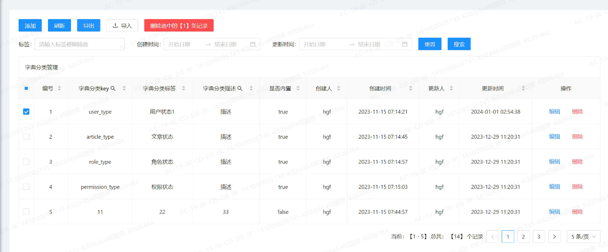
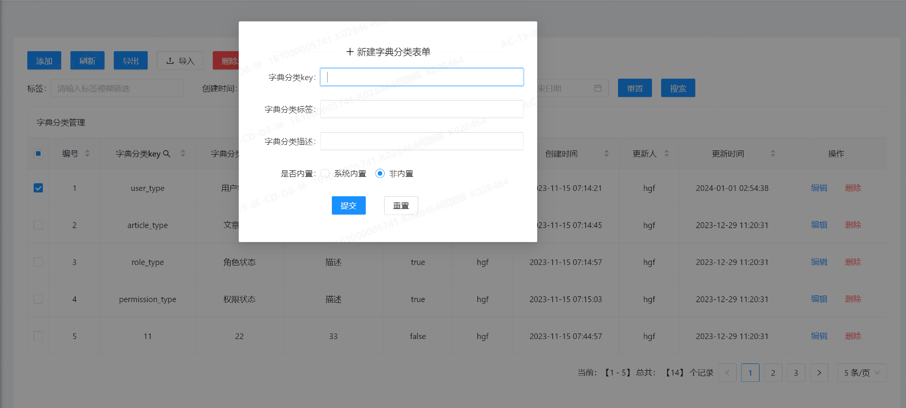
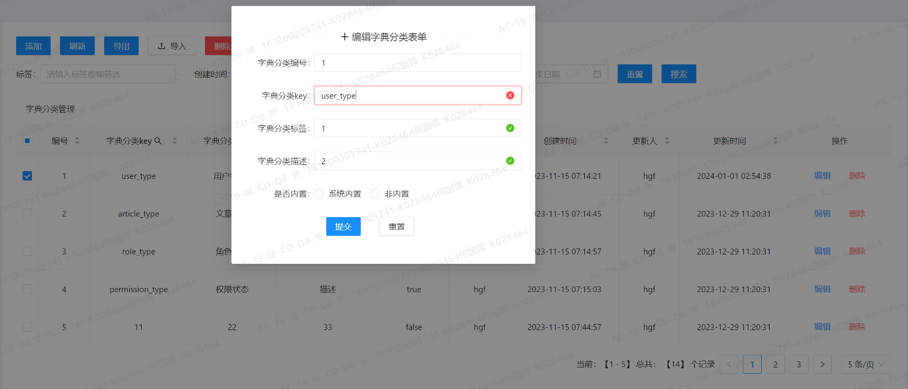

:source-highlighter: rouge
:sectnums:
:sectnumlevels: 4
:toc: left
:toc-title: 目录
:toclevels: 4
:experimental:
:source-language: shell

== 启动维护

----
# 启动命令
ng serve --host 0.0.0.0 --proxy-config proxy.conf.json
----

== 后台管理系统设计实践

=== 文件用途

==== 非源码目录文件
* *.editorconfig* 编辑器默认行为文件
* *angular.json* angular配置文件
* *package.json* 指示这是一个npm项目，声明的项目的命名，快捷脚本以及用到的基础依赖
* *pnpm-lock.yaml* 依赖及版本的声明和锁定文件
* *proxy.conf.json* 代理配置文件（哪些url是要请求到后端的）
* *tsconfig 套装文件* 指示这是一个Typescript项目，以及如何编译成js的动作行为

==== src 源码目录

*app.module.ts*

应用级别的模块管理，声明三方个性化模块导入

*app-routing.module.ts*

应用级别的路由导航，顶级路由信息维护

*app.component 套件*

定义路由出口，一些公共的样式等

*assets/*** 放一些资源文件

*environments/*** 放一些环境变量文件（本地/线上）

*index.html* 首页，上面埋了一个应用的结构根 `<app-root></app-root>`

*theme.less* 主题样式，这里导入了 `ant-design` 控件的样式

*styles.scss* 定义公共样式

*styles.scss* 定义公共样式

==== src/app 子目录

按照系统模块进行分类

* system: 系统管理模块
* other: 无法或者不好分类的功能模块
* home: 主页控制
* main-data: 主数据维护
* shared: 共享公共模块（通用的功能，可复用控件等）

模块目录约定

* components: 功能界面组件(结构、样式、逻辑)
* domain: 领域设计
* services: 服务类（复杂的业务逻辑处理，跟后端的接口交互等）
* control: 模块控件（若干个dom及其js逻辑组成的最小化可复用基本功能单元）
* constant: 模块内的公用常量定义，由一个index.ts进行导出，如果是shared模块则是导出给全模块可用
* function: 模块内的公用方法定义，由一个index.ts进行导出，如果是shared模块则是导出给全模块可用
* handler: 事件、场景处理器，应该是一个可注入的ts类作为表现形式

=== 最佳实践约定
. 多用 `index.ts`: 利用js的 `export` 功能，将本文件的内容，一层层进行导出，这样其它模块使用的时候可用得到一个最短引用路径，和最少引用说明

== 模块设计

=== 增删改查，基础实体维护设计

.增删改查-主界面

.增删改查-新增界面

.增删改查-编辑界面

接口规划：

. 查询-分页查询+后端字段排序+模糊查询+时间范围
. 查询-唯一标识列（id）查询
. 新增-实体保存
. 编辑-实体保存
. 新增/编辑-唯一键值约束查询（用户名已经存在/不能修改为已存在的用户名）
. 删除-id主键删除
. 删除-多id主键删除

界面规划：

需要主界面和新增/编辑界面共两个界面

主界面：进行各项条件下的分页浏览和删除、导入导出等操作。
新增和编辑界面：通过主界面触发进行新增和单个记录的编辑维护的界面。

==== 功能单元代码规划

===== 领域实体类设计
一个实体有三种形式:

. ViewObject类（后端传递过来，前端接收然后进行展示），命名 UserVO
. Normal类（前端本身做一些轻量化业务逻辑处理），命名 User
. DataTransferObject类（传给后端controller层），命名 UserDTO

他们其实就是后端领域模型设计（DTO,BO,PO,VO）的延续，只不过少一个持久化层而已。

抽取公共字段作为基类（BaseVO,BaseDTO），公共字段有【id|createdBy|createdTime|updatedBy|updatedTime】

===== 服务类、接口设计

结构设计：上层接口做方法签名定义，下层做实现

设计思想：为了做好所有所有有单体增删改查需求的实体的共同基类，全部利用 `泛型` 或者 `any类型` 做处理，把公共行为的代码尽量在基类全部给写完，同时留有扩展（预留空白方法，或者是子类进行覆盖等）

依赖需求：引入 `HttpClient` 等组件实行接口发送等

方法签名列表介绍：

[, typescript]
----
export interface BaseInterface<DTO extends BaseDTO, VO extends BaseVO> {

  /**
   * 通过 id 查询数据详情
   * @param id
   */
  getDatum(id: number): Observable<Result>;

  /**
   * 列表查询
   * @param pageable 分页对象
   * @param baseDTO 传输层对象
   */
  getData(pageable: Pageable, baseDTO: BaseDTO): Observable<Result>;

  /**
   * 添加单条数据
   * （通过唯一ID确定，即除了ID和空字段，其它的全部覆盖更新）
   * @param data 传输层对象
   */
  addDatum(data: DTO): Observable<Result>;

  /**
   * 更改单条数据
   * @param data 传输层对象
   */
  updateDatum(data: DTO): Observable<Result>;

  /**
   * 删除所选的数据
   * @param ids
   */
  deleteData(ids: Set<Number>): Observable<Result>;

  /**
   * 删除单个数据
   * @param id
   */
  deleteDatum(id: number): Observable<Result>;

  /**
   * 指定列的对应值是否存在
   * 用途：如添加用户时，检测用户名、邮箱是否已经存在等的判定
   */
  columnDataExists(columnName: string, columnValue: any): Observable<Result>;
}
----

===== 主界面组件类逻辑设计(ts)

===== 主界面组件类界面设计(html)

===== 新增/编辑界面组件类逻辑设计(ts)

===== 新增/编辑界面组件类界面设计(html)

== 当下流行（相对于jQuery）的前端主流特性介绍

=== observable
这是个人觉得最难懂的一部分

